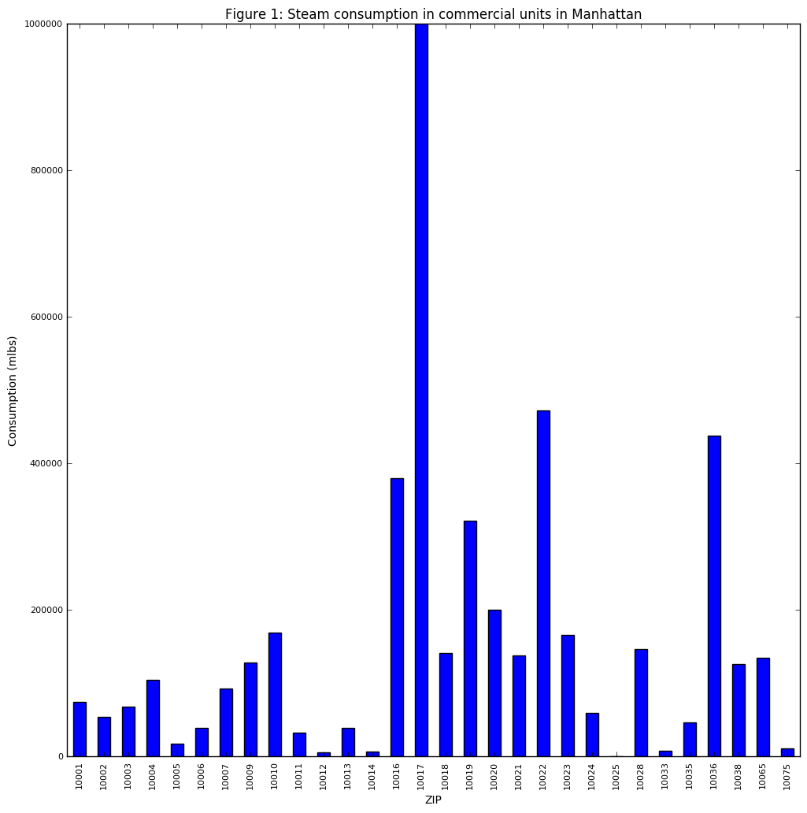

### Plot Review

This plot aims to show total steam consumption in commercial buildings by zip code in Manhattan, for a period of one year (2010). The plot
is for the most part clear and readable. A bar plot is a good choice in this case to show relative quantities, and the differences in values
here make for a clear representation in the plot.

Several notes:
* I am not 100% certain about this, but I think it may be standard practice to omit the figure number from the title if it is used in the caption.
* The tallest bar runs into the top of the graph - I would recommend leaving a little space here or removing the top axis line (and the right one), just to simplify the plot and to remove any doubts that the highest value may have been cut off.
* I would increase the size of the axis tick labels slightly.
* I would compress the y dimension of the plot, since the differences are large enough to be visible even if compressed. This will make the whole plot, including bar heights and labels, more easily reviewable at a glance.

